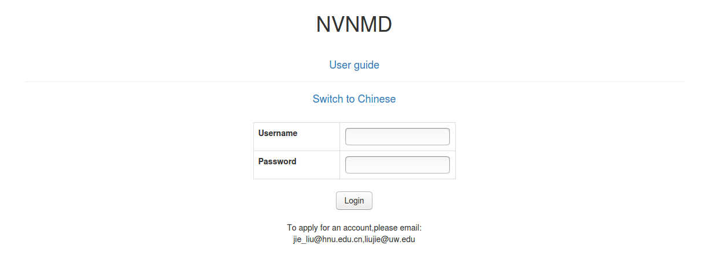
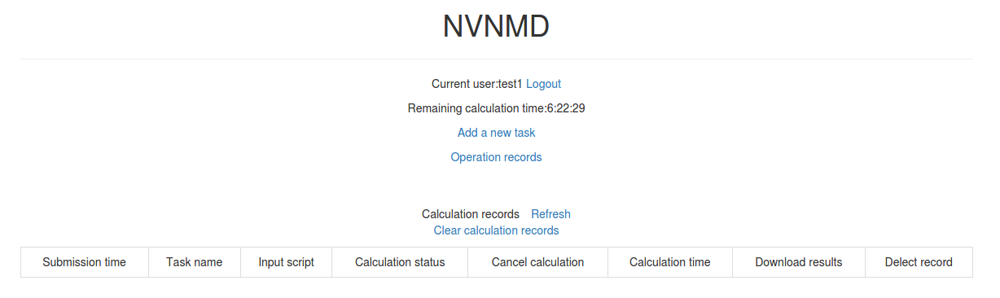
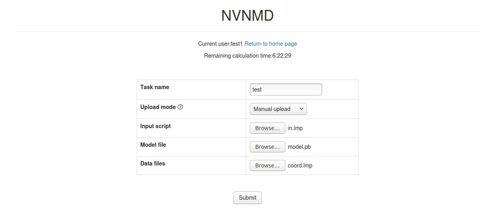
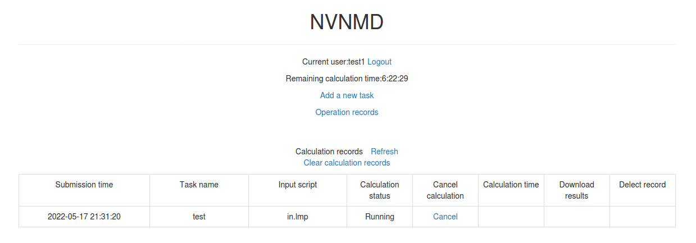
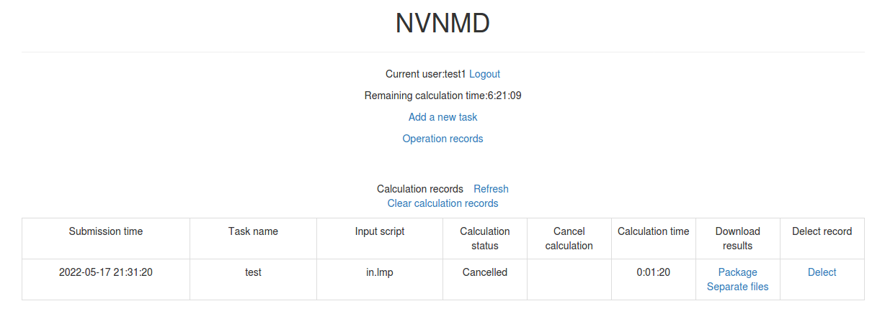
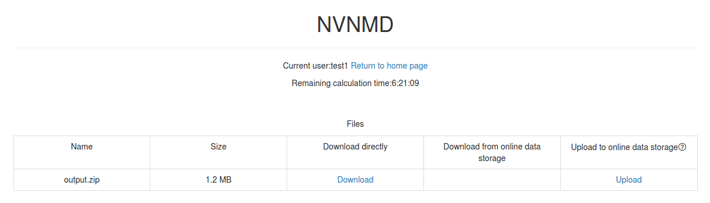
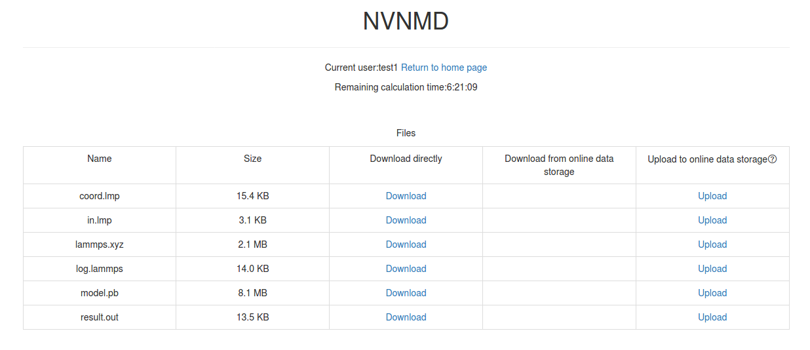

# NVNMD example
- [1 Introduction](#1-introduction)
- [2 Training](#2-training)
    - [2-1 Input script](#2-1-input-script)
        - [2-1-1 nvnmd](#2-1-1-nvnmd)
        - [2-1-2 learning_rate](#2-1-2-learning_rate)
        - [2-1-3 loss](#2-1-3-loss)
        - [2-1-4 training](#2-1-4-training)
        - [2-1-5 model](#2-1-5-model)
    - [2-2 Training](#2-2-training)
- [3 Testing](#3-testing)
- [4 Running MD](#4-running-md)
    - [4-1 Account application](#4-1-account-application)
    - [4-2 Adding task](#4-2-adding-task)
    - [4-3 Cancelling calculation](#4-3-cancelling-calculation)
    - [4-4 Downloading results](#4-4-downloading-results)
    - [4-5 Deleting record](#4-5-deleting-record)
    - [4-6 Clearing records](#4-6-clearing-records)


# 1 Introduction

NVNMD stands for non-von Neumann molecular dynamics.

Any user can follow two consecutive steps to run molecular dynamics (MD) on the proposed NVNMD computer, which has been released online: (i) to train a machine learning (ML) model that can decently reproduce the potential energy surface (PES); and (ii) to deploy the trained ML model on the proposed NVNMD computer, then run MD there to obtain the atomistic trajectories.

The training code can be downloaded from the [website](https://github.com/LiuGroupHNU/deepmd-kit/tree/devel). This codebase was used to generate the results reported for NVNMD-v1 in our paper entitled "Accurate and Efficient Molecular Dynamics based on Machine Learning and Non Von Neumann Architecture", which has been accepted by npj Computational Materials ([DOI: 10.1038/s41524-022-00773-z](https://www.nature.com/articles/s41524-022-00773-z)). The same training framework has been extended for NVNMD-v2 (“NVNMD-v2: Scalable and Accurate Deep Learning Molecular Dynamics Model Based on Non-Von Neumann Architectures” , manuscript ID: ct-2025-01050u, submitted to ACS Journal of Chemical Theory and Computation), which introduces an optimized descriptor to support multi-element systems .

This repository provides complete examples for training and running MD on both NVNMD-v1 and NVNMD-v2. The file structure is as follows.

* `data`: training and testing data set.
* `train/train_cnn.json`: input script of the continuous neural network (CNN) training.
* `train/train_qnn.json`: input script of the quantized neural network (QNN) training.
* `md/coord.lmp`: data file containing initial atom coordinates for NVNMD-v1 examples.
* `md/in.lmp`: input script of the molecular dynamics simulation for NVNMD-v1 examples.
* `md/model.pb`: model file obtained by QNN training (NVNMD-v1).
* `md-v2`: NVNMD-v2 LAMMPS run scripts for the three example systems (Au, GeTe and Ferro).  Each case folder also contains the corresponding training JSONs, and all datasets can be downloaded from AIS Square: [website](https://www.aissquare.com/datasets).

# 2 Training

Our training procedure consists of not only the continuous neural network (CNN) training, but also the quantized neural network (QNN) training which uses the results of CNN as inputs. It is performed on CPU or GPU by using the training codes we open-sourced online.

To train a ML model that can decently reproduce the PES, training and testing data set should be prepared first. This can be done by using either the state-of-the-art active learning tools, or the outdated (i.e., less efficient) brute-force density functional theory (DFT)-based ab-initio molecular dynamics (AIMD) sampling.

Then, copy the data set to working directory

```bash
mkdir -p $workspace
cd $workspace
mkdir -p data
cp -r $nvnmd_example/data data
```

where `$workspace` is the path to working directory and `$nvnmd_example/data` is the path to the data set used in this example. 

## 2-1 Input script

Create and go to the training directory.


```bash
mkdir train
cd train 
```

Then copy the input script `train_cnn.json` and `train_qnn.json` to the directory `train`

```bash
cp -r $nvnmd_example/train/train_cnn.json train_cnn.json
cp -r $nvnmd_example/train/train_qnn.json train_qnn.json
```

The structure of the input script is as follows

```json
{
    "nvnmd" : {},
    "learning_rate" : {},
    "loss" : {},
    "training": {},
    "model": {}
}
```

### 2-1-1 nvnmd

The "nvnmd" section is defined as 

```json
{
    "version": 0,
    "max_nnei": 128,
    "net_size":128,
    "sel":[60, 60],
    "rcut":6.0,
    "rcut_smth":0.5,
    "type_map": ["Ge", "Te"]
}
```

where items are defined as:

| Item      | Mean                                                         | Optional Value                                               |
| --------- | ------------------------------------------------------------ | ------------------------------------------------------------ |
| version   | the version of network structure                             | 0: `NVNMD-v1`; 1: `NVNMD-v2`                                 |
| max_nnei  | the maximum number of neighbors that do not distinguish element types | 128 or 256                                                   |
| net_size  | the size of nueral network                                   | 128                                                          |
| sel       | the number of neighbors                                      | `NVNMD-v1`: integer list of lengths 1 to 4 are acceptable; `NVNMD-v2`: integer |
| rcut      | the cutoff radial (Å)                                    | (0, 8.0]                                                     |
| rcut_smth | the smooth cutoff parameter (Å)                          | (0, 8.0]                                                     |
| type_map  | mapping atom type to the name (str) of the type              | string list, optional                                        |

Multiple versions of the NVNMD model correspond to different network structures. `NVNMD-v1` and `NVNMD-v2` differ in the following ways:

1. `NVNMD-v1` and `NVNMD-v2` use the `se_a` descriptor and `se_atten` descriptor, respectively
2. `NVNMD-v1` has 1 set of parameters for each element and supports up to 4 element types. `NVNMD-v2` shares 1 set of parameters for each element and supports up to 31 types.
3. `NVNMD-v1` distinguishes between neighboring atoms, so `sel` is a list of integers. `NVNMD-v2` does not distinguish between neighboring atoms, so `sel` is an integer.
   
### 2-1-2 learning_rate

The "learning_rate" section is defined as 

```json
{
    "type":"exp",
    "start_lr": 1e-3,
    "stop_lr": 3e-8,
    "decay_steps": 5000
}
```

where items are defined as:

| Item        | Mean                                                         | Optional Value         |
| ----------- | ------------------------------------------------------------ | ---------------------- |
| type        | learning rate variant type                                   | exp                    |
| start_lr    | the learning rate at the beginning of the training           | a positive real number |
| stop_lr     | the desired learning rate at the end of the training         | a positive real number |
| decay_stops | the learning rate is decaying every {decay_stops} training steps | a positive integer     |

### 2-1-3 loss

The "loss" section is defined as 

```json
{
    "start_pref_e": 0.02,
    "limit_pref_e": 2,
    "start_pref_f": 1000,
    "limit_pref_f": 1,
    "start_pref_v": 0,
    "limit_pref_v": 0
}
```

where items are defined as:

| Item         | Mean                                                       | Optional Value               |
| ------------ | ---------------------------------------------------------- | ---------------------------- |
| start_pref_e | the loss factor of energy at the beginning of the training | zero or positive real number |
| limit_pref_e | the loss factor of energy at the end of the training       | zero or positive real number |
| start_pref_f | the loss factor of force at the beginning of the training  | zero or positive real number |
| limit_pref_f | the loss factor of force at the end of the training        | zero or positive real number |
| start_pref_v | the loss factor of virial at the beginning of the training | zero or positive real number |
| limit_pref_v | the loss factor of virial at the end of the training       | zero or positive real number |

### 2-1-4 training

The "training" section is defined as 

```json
{
  "seed": 1,
    "stop_batch": 1000000,
    "numb_test": 1,
    "disp_file": "lcurve.out",
    "disp_freq": 1000,
    "save_ckpt": "model.ckpt",
    "save_freq": 10000,
    "training_data":{
      "systems":["system1_path", "system2_path", "..."],
      "set_prefix": "set",
      "batch_size": ["batch_size_of_system1", "batch_size_of_system2", "..."]
    }
}
```

where items are defined as:

| Item       | Mean                                                | Optional Value     |
| ---------- | --------------------------------------------------- | ------------------ |
| seed       | the randome seed                                    | a integer          |
| stop_batch | the total training steps                            | a positive integer |
| numb_test  | the accuracy is test by using {numb_test} sample    | a positive integer |
| disp_file  | the log file where the training message display     | a string           |
| disp_freq  | display frequency                                   | a positive integer |
| save_ckpt  | check point file                                    | a string           |
| save_freq  | save frequency                                      | a positive integer |
| systems    | a list of data directory which contains the dataset | string list        |
| set_prefix | the prefix of dataset                               | a string           |
| batch_size | a list of batch size of corresponding dataset       | a integer list     |

### 2-1-5 model

The `model` section of the training JSON specifies the neural-network architecture used for descriptor (embedding) extraction and the fitting network that maps embeddings to scalar energies (and forces). Section **2-1-1** already documents the top-level `nvnmd` keys (e.g. `version`, `sel`, `rcut`, `rcut_smth`, `type_map`) which determine descriptor selection and neighbor handling; here we focus on the **network structure** and the `model` block that contains the per-model defaults shown in the configuration file.

> **Note:** In NVNMD the `model` block is often optional for users because the framework provides sensible defaults. We list them here explicitly for reproducibility. Users may override any field in their JSON if customization is needed.

The "model" section is defined as (used for the GeTe `NVNMD-v2` example): 

```json
"model": {
    "descriptor": {
        "type": "se_atten",
        "sel": 256,
        "rcut": 8.0,
        "rcut_smth": 2.0,
        "neuron": [8, 16, 32]
    },
    "fitting_net": {
        "neuron": [128, 128, 128]
    },
    "type_map": ["Ge", "Te"]
}
```

As mentioned above, `NVNMD-v1` use the `se_a` descriptor, while `NVNMD-v2` use the `se_atten` descriptor: 

| Topic                         | `se_a` (NVNMD-v1)                                            | `se_atten` (NVNMD-v2)                                        |
| ----------------------------- | ------------------------------------------------------------ | ------------------------------------------------------------ |
| Descriptor type               | per-type descriptor branches                                 | Attention-augmented descriptor with type embeddings          |
| Input to embedding net        | neighbors distinguished by element type                      | Concatenated neighbors and atom types                        |
| `sel`                         | List per type (e.g., `[60,60]`) — neighbor counts per type   | Single integer (e.g., `256`) — unified neighbor slots        |
| Parameterization across types | Separate embedding parameters per element (up to 4 types practical) | Shared embedding network with learned type embeddings (scales to many types) |
| Embedding network             | via `neuron` (typical: `[8,16,32]`)                          | via `neuron` (typical: `[8,16,32]`)                          |
| Fitting network               | Fully connected FittingNet, typical sizes: `[128,128,128]`   | Fully connected FittingNet, typical sizes: `[128,128,128]`   |

## 2-2 Training

Training can be invoked by

```bash
# step1: train CNN
dp train-nvnmd train_cnn.json -s s1
# step2: train QNN
dp train-nvnmd train_qnn.json -s s2
```

After training process, you will get two folders: `nvnmd_cnn` and `nvnmd_qnn`. The `nvnmd_cnn` contains the model after continuous neural network (CNN) training. The `nvnmd_qnn` contains the model after quantized neural network (QNN) training. The binary file `nvnmd_qnn/model.pb` is the model file which is used to perform NVNMD in server [http://nvnmd.picp.vip]

You can also restart the CNN training from the path prefix of checkpoint files (`nvnmd_cnn/model.ckpt`) by

```bash
dp train-nvnmd train_cnn.json -r nvnmd_cnn/model.ckpt -s s1
```

You can also initialize the CNN model and train it by

```bash
mv nvnmd_cnn nvnmd_cnn_bck
cp train_cnn.json train_cnn2.json
# please edit train_cnn2.json
dp train-nvnmd train_cnn2.json -s s1 -i nvnmd_cnn_bck/model.ckpt
```

> **Note:** Training recipes and example JSONs for `NVNMD-v2` are provided in this repository under the `md-v2/` directories (for example `md-v2/GeTe/`, `md-v2/Au/`, `md-v2/Ferro/`). Each per-case folder contains the per-case training JSON(s). To train `NVNMD-v2` models you may either (a) use the provided v2 JSON directly, or (b) set `"version": 1` in the `nvnmd` block of your training JSON and run the same CLI above.

# 3 Testing

The frozen model can be used in many ways. The most straightforward testing can be invoked by

```bash
mkdir test
dp test -m ./nvnmd_qnn/frozen_model.pb -s path/to/system -d ./test/detail -n 99999 -l test/output.log
```

where the frozen model file to import is given via the `-m` command line flag, the path to the testing data set is given via the `-s` command line flag, the file containing details of energy, force and virial accuracy is given via the `-d` command line flag, the amount of data for testing is given via the `-n` command line flag.

# 4 Running MD

After CNN and QNN training, you can upload the ML model to our online NVNMD system and run MD there.

## 4-1 Account application

The server website of NVNMD is available at http://nvnmd.picp.vip. You can visit the URL and enter the login interface (Figure.1).


<center>Figure.1 The login interface</center>

To obtain an account, please send your application to the email (jie_liu@hnu.edu.cn, liujie@uw.edu). The username and password will be sent to you by email.

## 4-2 Adding task

After successfully obtaining the account, enter the username and password in the login interface, and click "Login" to enter the homepage (Figure.2).


<center>Figure.2 The homepage</center>

The homepage displays the remaining calculation time and all calculation records not deleted. Click `Add a new task` to enter the interface for adding a new task (Figure.3).


<center>Figure.3 The interface for adding a new task</center>

- Task name: name of the task
- Upload mode: two modes of uploading results to online data storage, including `Manual upload` and `Automatic upload`. Results need to be uploaded manually to online data storage with `Manual upload` mode, and will be uploaded automatically with `Automatic upload` mode.
- Input script: input file of the MD simulation. `$nvnmd_example/md/in.lmp` can be used directly in this example.

In the input script, one needs to specify the pair style as follows

```lammps
pair_style nvnmd model.pb
pair_coeff * *
```

- Model file: the ML model named `model.pb` obtained by QNN training. You can use `$nvnmd_example/md/model.pb` directly to test in this example without training by yourself.
- Data files: data files containing information required for running an MD simulation (e.g., `coord.lmp` containing initial atom coordinates). `$nvnmd_example/md/coord.lmp` can be used directly in this example.

Next, you can click `Submit` to submit the task and then automatically return to the homepage (Figure.4).


<center>Figure.4 The homepage with a new record</center>

Then, click `Refresh` to view the latest status of all calculation tasks.

## 4-3 Cancelling calculation

For the task whose calculation status is `Pending` and `Running`, you can click the corresponding `Cancel` on the homepage to stop the calculation (Figure.5).


<center>Figure.5 The homepage with a cancelled task</center>

## 4-4 Downloading results

For the task whose calculation status is `Completed`, `Failed` and `Cancelled`, you can click the corresponding `Package` or `Separate files` in the `Download results` bar on the homepage to download results.

Click `Package` to download a zipped package of all files including input files and output results (Figure.6).


<center>Figure.6 The interface for downloading a zipped package</center>

Click `Separate files` to download the required separate files (Figure.7).


<center>Figure.7 The interface for downloading separate files</center>

If `Manual upload` mode is selected or the file has expired, click `Upload` on the download interface to upload manually.

## 4-5 Deleting record

For the task no longer needed, you can click the corresponding `Delete` on the homepage to delete the record.

Records cannot be retrieved after deletion.

## 4-6 Clearing records

Click `Clear calculation records` on the homepage to clear all records.

Records cannot be retrieved after clearing.
